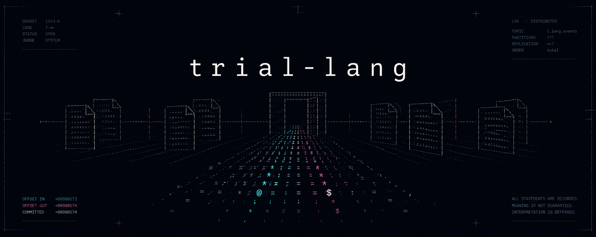
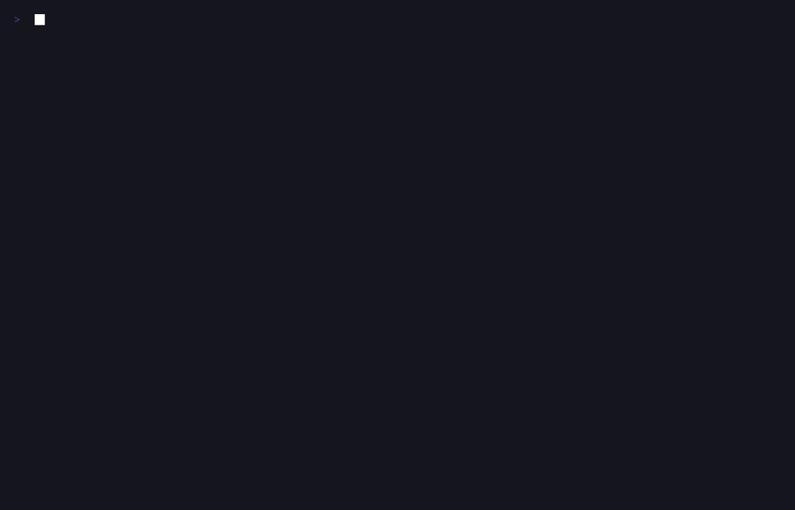
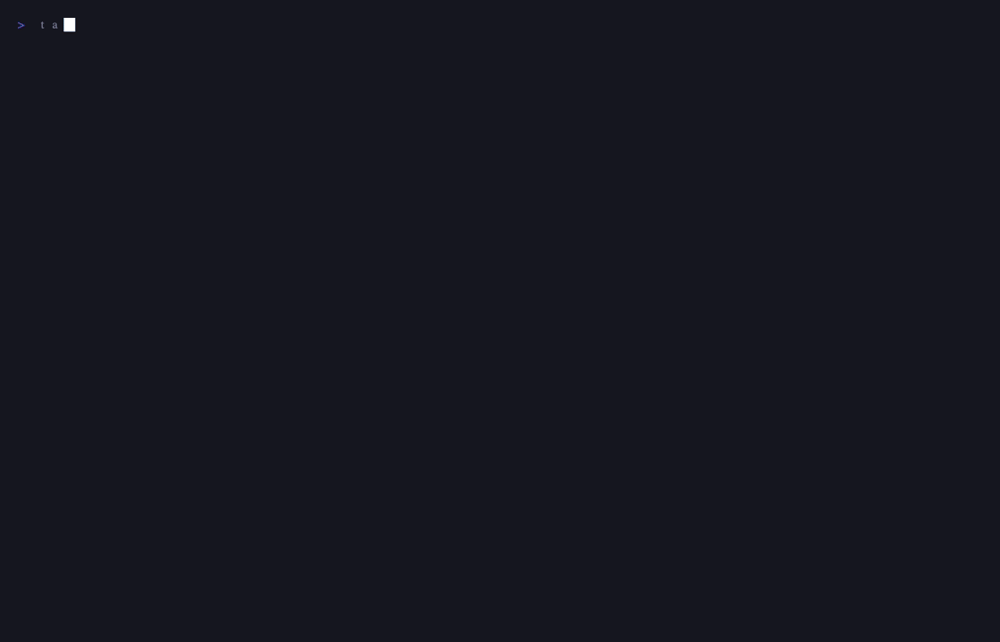
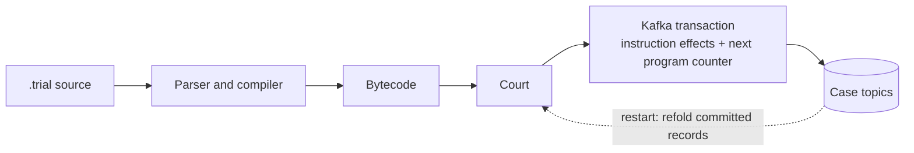

# triallang

*A toy programming language backed by Apache Kafka.*

> [!NOTE]
> triallang is an independent project. It is not affiliated with, endorsed by,
> or sponsored by Apache Kafka or the Apache Software Foundation. Its
> terminology borrows from Franz Kafka's fiction.

triallang is a toy programming language that writes program state to Apache
Kafka. Programs are cases, statements use legal English and end with a period,
and the interpreter is called the Court.

```trial
FORM K-1.
IN THE MATTER OF: hello.

ARTICLE 1.
    PROCLAIM "Hello, world.".
    ADJOURN INDEFINITELY.
```

The repository includes an in-memory adapter for tests and examples. You do not
need Kafka for the quickstart.

## Quickstart

Prerequisite: Go 1.27.0.

Install the v0.1.0 release:

```console
go install github.com/lennrt/trial-lang/cmd/trial@v0.1.0
trial version
```

[Prebuilt archives and checksums](https://github.com/lennrt/trial-lang/releases/tag/v0.1.0)
are available for Linux, macOS, and Windows on AMD64 and ARM64.

Run one brokerless example:

```console
go run ./cmd/trial test examples/hello.deposition
```

Run the complete brokerless example suite:

```console
go run ./cmd/trial test examples
```

Or build the CLI from this checkout:

```console
go build -o trial ./cmd/trial
./trial version
```

## Demo

The recovery demo uses a real local Kafka broker. It files a case, interrupts
one `trial proceed` process after a continuance is committed, and starts a new
process for the same case. It then checks that both committed output lines
appear once and that an audit can reproduce the result.



Run it with Docker Compose and Go 1.27.0:

```console
go build -o trial ./cmd/trial
./docs/the-recovery-demo.sh
```

The script starts its own broker when needed. On exit, it tries to delete the
demo case and stops a broker it started.

### Brokerless animation

The Orrery is a smaller visual example. It records each frame number before
printing a rotating ASCII sphere, so another process can continue from the
recorded position.



Run it without Kafka:

```console
./docs/the-orrery-demo.sh
```

Check its generated frames without wall-clock delays:

```console
go run ./cmd/trial test examples/the-orrery.deposition
```

## Live broker workflow

Prerequisites: Docker with Compose and Go 1.27.0.

Start one local KRaft broker:

```console
./trial summon
```

File and run a case:

```console
./trial file examples/hello.trial
./trial proceed case-...
./trial observe case-...
```

`file` prints the case number. Replace `case-...` with that value.

Stop the local broker when you finish:

```console
docker compose down
```

The Compose configuration uses plaintext localhost transport. Do not use it as
a production broker configuration.

## Language overview

triallang supports:

- 64-bit integers, fixed-point sums, strings, and findings;
- variables, constants, schedules, registers, and exhibits;
- conditional control flow and article jumps;
- offices, parameters, return values, and recursion;
- topic-backed input, output, files, timers, and random values;
- case-to-case notices, case creation, supervision, and the gazette;
- statutes and the bundled canon; and
- depositions for brokerless tests.

Use these files as the normative language references:

- [language specification](spec/spec.md)
- [grammar](spec/grammar.ebnf)
- [bytecode](spec/bytecode.md)
- [Kafka topic layout](spec/topics.md)

The examples under [examples](examples) show the supported syntax. Start with
`hello`, `countdown`, and `the-procession`.

## Architecture



## Runtime model

A Kafka-backed case stores its source, bytecode, variables, stacks, input,
output, ledger, and execution position in topics. The Court uses Kafka
transactions to commit an instruction's effects with its next position. Reads
use committed data.

A transaction timeout has an ambiguous result. The runtime returns a typed
`AmbiguousCommitError`; before retrying, an execution caller must reread
attention and a paperwork caller must inspect the affected topics. If initial
case creation or population may have left topics behind, `File` returns the
minted case identifier with the error; `Appeal` does the same for a new appeal,
and `OpenHearing` retains it in the returned hearing. The CLI and MCP filing
tool print any such recovery identifier. A definite filing failure returns no
case after successful cleanup. Retrying service, amendment, enactment, or
reenactment blindly can duplicate committed records. Concurrent amendments to
one case from separate processes are not supported.

The in-memory adapter implements atomic batches for deterministic tests. It does
not prove the behavior of a live broker.

See the [threat model](docs/threat-model.md) for trust boundaries, resource
limits, and residual risks. See the
[runtime-boundary ADR](docs/adr/0001-runtime-boundaries.md) for compatibility
decisions.

## Operational limits

- The local broker has no authentication, authorization, or TLS.
- Kafka deployment, backup, retention, ACL, and disaster-recovery policy belong
  to the operator.
- One case executes in one ordered stream. Use separate cases for concurrency.
- A Kafka-backed instruction requires broker transactions and is not intended
  for low-latency loops.
- The repository has unit, property, race, fuzz, and Kafka integration tests.
- Crash and replay tests cover repository-defined fault points. They do not
  establish universal crash safety or operational durability.
- Benchmark results apply only to their recorded revision, hardware, broker,
  and configuration.

## Verification

Run the required local checks with Go 1.27.0:

```console
make verify
make vuln
```

Run the Kafka integration tests with the pinned Compose image:

```console
docker compose up -d
TRIAL_E2E_BROKER=localhost:9092 go test -timeout=10m ./internal/court \
  -run '^(TestE2E|TestDifferential)' -count=1 -v
docker compose down
```

CI also builds the CLI and runs
[`scripts/kafka-cli-smoke.sh`](scripts/kafka-cli-smoke.sh) through `file`,
`proceed`, `status`, `audit`, and `burn` against Kafka.

The CI, security, and release workflows do not run on a schedule. See
[testing](docs/testing.md), [toolchain](docs/toolchain.md), and
[contributing](CONTRIBUTING.md) for the complete commands and policies.

## Interfaces

The CLI includes case operations, depositions, the Advocate MCP server, and the
Counsel language server. Run `trial help` for commands.

`canon` is the only importable Go package. See the
[Go API compatibility record](docs/api-compatibility.md).

## License

The project uses the Apache License 2.0. Release archives include dependency
license texts under `THIRD_PARTY_LICENSES`.
