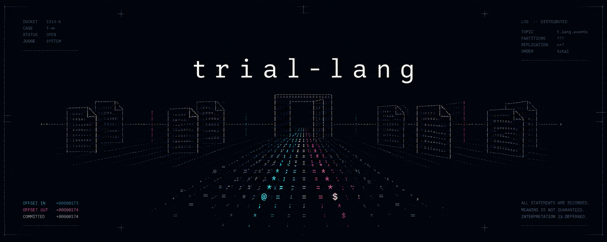
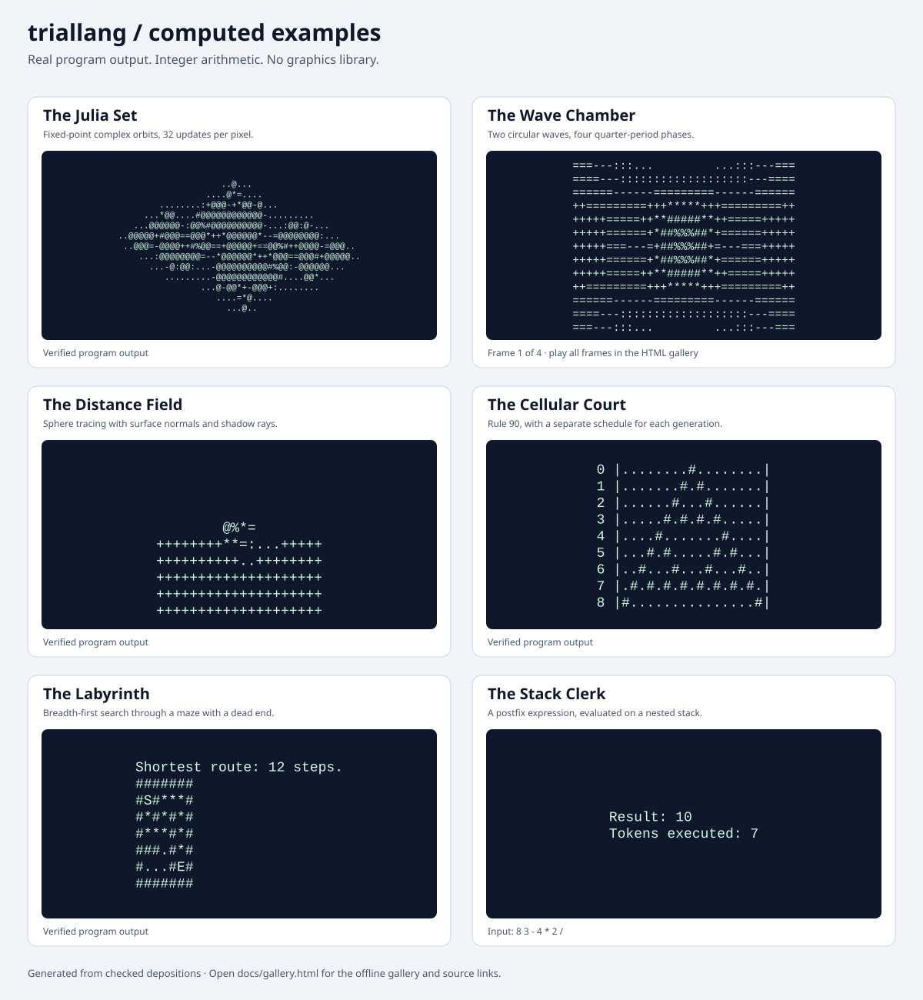
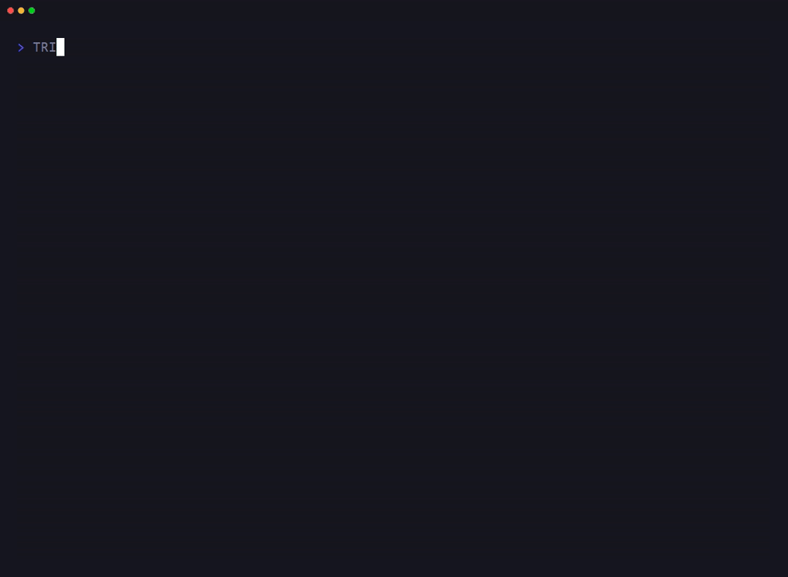
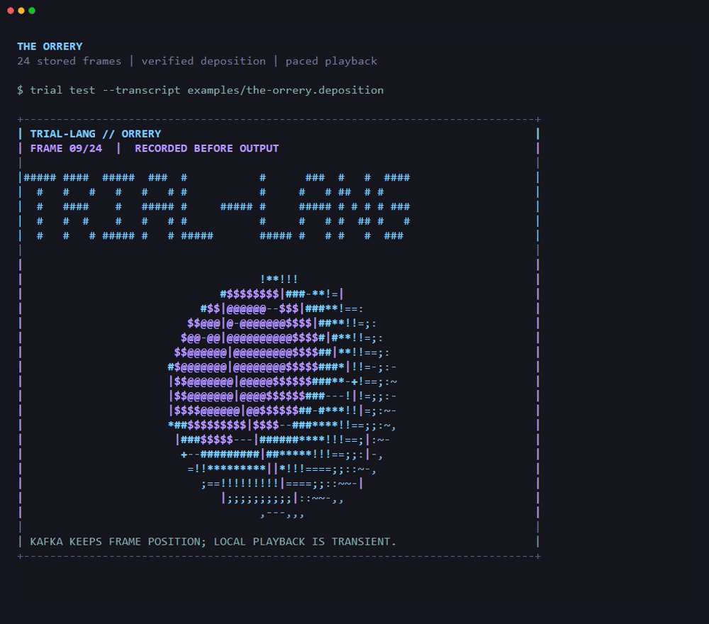
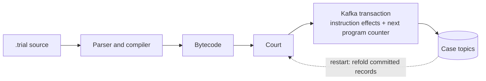

# triallang

[](https://github.com/lennrt/trial-lang/releases/latest)
[](LICENSE)
[](https://github.com/lennrt/trial-lang/actions/workflows/ci.yml)
[](https://www.bestpractices.dev/projects/14461)
[](go.mod)
[](https://pkg.go.dev/github.com/lennrt/trial-lang/canon)
[](https://github.com/lennrt/trial-lang/stargazers)

*A toy programming language backed by Apache Kafka.*

> [!NOTE]
> triallang is an independent project. It is not affiliated with, endorsed by,
> or sponsored by Apache Kafka or the Apache Software Foundation. Its
> terminology borrows from Franz Kafka's fiction.

triallang is a toy programming language that writes program state to Apache
Kafka. Programs are cases, statements use legal English and end with a period,
and the interpreter is called the Court.

```trial
FORM K-1.
IN THE MATTER OF: hello.

ARTICLE 1.
    PROCLAIM "Hello, world.".
    ADJOURN INDEFINITELY.
```

The repository includes an in-memory adapter for local runs and tests. You do
not need Kafka for the quickstart. Local state lasts only until the command ends.

## Quickstart

Prerequisite: Go 1.27.0.

Install the latest release:

```console
go install github.com/lennrt/trial-lang/cmd/trial@latest
trial version
```

[Prebuilt archives and checksums](https://github.com/lennrt/trial-lang/releases/latest)
are available for Linux, macOS, and Windows on AMD64 and ARM64.

To use the examples and development commands below, start in a source checkout:

```console
git clone https://github.com/lennrt/trial-lang.git
cd trial-lang
```

Run a program from this checkout without Kafka:

```console
go run ./cmd/trial run examples/hello.trial
```

Supply input with `--serve`. Repeat the flag for each input value:

```console
go run ./cmd/trial run examples/countdown.trial --serve 3
```

`run` prints the main case's output as instructions commit. Its default timeout
is 30 seconds. Use `--timeout 2m` for a longer run. See the
[local execution contract](docs/interfaces.md#local-execution) for limits and exit codes.

A deposition is a test file with inputs and expected results. Run one deposition:

```console
go run ./cmd/trial test examples/hello.deposition
```

Run every example deposition:

```console
go run ./cmd/trial test examples
```

On Linux or macOS, build the CLI from this checkout:

```console
go build -o trial ./cmd/trial
./trial version
```

On Windows, use `go build -o trial.exe ./cmd/trial` and `./trial.exe version`.

## Programs to explore

The [example index](docs/examples.md) covers every source file, including its
inputs, dependencies, and expected failures. The [toy guide](docs/toys.md)
explains the algorithms and the values that you can change.
The [shader guide](docs/shaders.md) explains the rendering calculations.



Open the [offline gallery](docs/gallery.html) from your checkout to play the wave
frames and inspect the exact output. Regenerate both previews with
`go run ./tools/examplegallery -write -root .`.

Watch terminal recordings in the [shader guide](docs/shaders.md) and
[toy guide](docs/toys.md). The [six GIFs and their VHS tapes](docs/examples.md#record-the-examples)
include commands to record them again from this checkout.

| Program | What it computes | Run from the checkout |
| --- | --- | --- |
| Cellular Court | Rule 90 generations from neighboring cells | `go run ./cmd/trial run examples/the-cellular-court.trial` |
| Labyrinth | A shortest route through a maze | `go run ./cmd/trial run examples/the-labyrinth.trial` |
| Stack Clerk | A postfix arithmetic expression | `go run ./cmd/trial run examples/the-stack-clerk.trial --serve "8 3 - 4 * 2 /"` |
| Julia set | An escape-time fractal | `go run ./cmd/trial run examples/the-julia-set.trial` |
| Wave chamber | Four frames of wave interference | `go run ./cmd/trial run --canon examples/the-wave-chamber.trial` |
| Distance field | Ray-marched spheres with surface lighting and shadows | `go run ./cmd/trial run examples/the-distance-field.trial` |

The shaders compute their pixels in triallang on the CPU. Their default canvases
are small because the Court records instruction effects. Each example includes
an exact-output deposition and independent algorithm checks.

## Demo

The recovery demo uses a real local Kafka broker. It files a case, interrupts
one `trial proceed` process after a continuance is committed, and starts a new
process for the same case. It then checks that both committed output lines
appear once and that an audit can reproduce the result.



Run it with Docker Compose and Go 1.27.0:

```console
go build -o trial ./cmd/trial
./docs/the-recovery-demo.sh
```

The script starts its own broker when needed. On exit, it tries to delete the
demo case and stops a broker it started.

### Brokerless animation

The Orrery plays generated frames of a rotating ASCII sphere. It records each
frame number before printing the frame. A Kafka-backed run can continue from
that recorded position after a process restarts. A brokerless run loses its
state when the command ends.



Run it without Kafka:

```console
./docs/the-orrery-demo.sh
```

Check its generated frames without wall-clock delays:

```console
go run ./cmd/trial test examples/the-orrery.deposition
```

The [recording guide](docs/demos/README.md) includes the Castle raycaster,
Procession animation, and source tapes for all ten demos. Each recording uses
the same terminal palette and window style, with pacing suited to its output.

## Live broker workflow

Prerequisites: Docker with Compose and Go 1.27.0.

Start one local KRaft broker:

```console
./trial summon
```

File and run a case:

```console
./trial file examples/hello.trial
./trial proceed case-...
./trial observe case-...
```

`file` prints the case number. Replace `case-...` with that value.

Stop the local broker when you finish:

```console
go run ./cmd/trial dismiss
```

The Compose configuration uses plaintext localhost transport. Do not use it as
a production broker configuration.

## Language overview

triallang supports:

- 64-bit integers, fixed-point sums, strings, and findings;
- variables, constants, schedules, registers, and exhibits;
- conditional control flow and article jumps;
- offices, parameters, return values, and recursion;
- topic-backed input, output, files, timers, and random values;
- case-to-case notices, case creation, supervision, and the gazette;
- statutes and the bundled canon; and
- depositions for brokerless tests.

Use these files as the normative language references:

- [language specification](spec/spec.md)
- [grammar](spec/grammar.ebnf)
- [bytecode](spec/bytecode.md)
- [Kafka topic layout](spec/topics.md)

The examples under [examples](examples) show the supported syntax. Start with
`hello` and `countdown`, then follow the [example index](docs/examples.md).

## Architecture


```mermaid
flowchart LR
    S[".trial source"] --> P["Parser and compiler"]
    P --> B["Bytecode"]
    B --> C["Court"]
    C --> T["Kafka transaction<br/>instruction effects + next program counter"]
    T --> K[("Case topics")]
    K -. "restart: refold committed records" .-> C
```

## Runtime model

A Kafka-backed case stores its source, bytecode, variables, stacks, input,
output, ledger, and execution position in topics. The Court uses Kafka
transactions to commit an instruction's effects with its next position. Reads
use committed data.

A transaction timeout can leave the commit result unknown. The runtime returns
a typed `AmbiguousCommitError`. Before retrying execution, a caller must reread
attention, the record of execution position. Before retrying paperwork, a caller
must inspect the affected topics.

If filing can leave topics behind, `File` returns the minted case identifier
with the error. `Appeal` does the same for a new appeal. `OpenHearing` retains
the identifier in its returned hearing. The CLI and MCP filing tool print these
recovery identifiers. A definite filing failure returns no case after successful
cleanup.

Retrying service, amendment, enactment, or reenactment without inspection can
duplicate committed records. Concurrent amendments from separate processes to
one case are not supported.

The in-memory adapter implements atomic batches for deterministic tests. It does
not prove the behavior of a live broker.

See the [threat model](docs/threat-model.md) for trust boundaries, resource
limits, and residual risks. See the
[runtime-boundary ADR](docs/adr/0001-runtime-boundaries.md) for compatibility
decisions.

## Operational limits

- The local broker has no authentication, authorization, or TLS.
- Kafka deployment, backup, retention, ACL, and disaster-recovery policy belong
  to the operator.
- One case executes in one ordered stream. Use separate cases for concurrency.
- A Kafka-backed instruction requires broker transactions and is not intended
  for low-latency loops.
- The repository has unit, property, race, fuzz, and Kafka integration tests.
- Crash and replay tests cover repository-defined fault points. They do not
  establish universal crash safety or operational durability.
- Benchmark results apply only to their recorded revision, hardware, broker,
  and configuration.

## Verification

Run the required local checks with Go 1.27.0:

```console
make verify
make vuln
```

`make help` lists every development target.

Run the Kafka integration tests with the pinned Compose image:

```console
docker compose up -d --wait --wait-timeout 120
TRIAL_E2E_BROKER=localhost:9092 go test -timeout=10m ./internal/court ./cmd/trial \
  -run '^(TestE2E|TestDifferential|TestCLI)' -count=1 -v
go run ./cmd/trial dismiss
```

`dismiss` retains stored case data. `docker compose down --volumes` also deletes
the data; use it only when those cases are no longer needed.

CI also builds the CLI and runs
[`scripts/kafka-cli-smoke.sh`](scripts/kafka-cli-smoke.sh) through `file`,
`proceed`, `status`, `audit`, and `burn` against Kafka.

The CI, security, and release workflows do not run on a schedule. See
[testing](docs/testing.md), [toolchain](docs/toolchain.md), and
[contributing](CONTRIBUTING.md) for the complete commands and policies.

## Interfaces

The CLI includes local execution, case operations, depositions, the Advocate MCP server, and the
Counsel language server. Run `trial help` for commands.
See the [interface reference](docs/interfaces.md) for inputs, outputs, protocol
limits, and API documentation.

`canon` is the only importable Go package. See the
[Go API compatibility record](docs/api-compatibility.md).

## Feedback and contributions

Report bugs and propose enhancements in [GitHub Issues](https://github.com/lennrt/trial-lang/issues).
Use the [contribution process](CONTRIBUTING.md) to propose a pull request.
Use [OpenSpec](docs/openspec.md) to record behavior changes and their acceptance scenarios.
Documentation, reports, and code-review discussions use English.
Report undisclosed vulnerabilities through the private channel in
[SECURITY.md](SECURITY.md).

The [OpenSSF assessment](docs/openssf.md) records evidence for the Passing
criteria. The badge above displays the current status of the public entry.

## License

The project uses the Apache License 2.0. Release archives include dependency
license texts under `THIRD_PARTY_LICENSES`.
