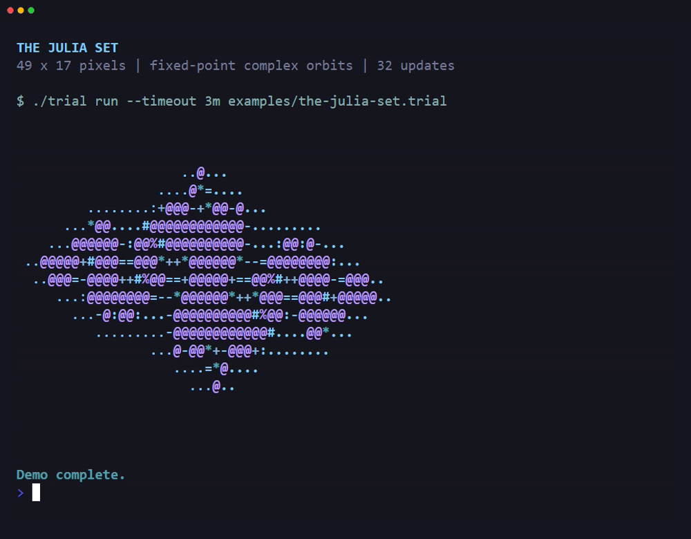
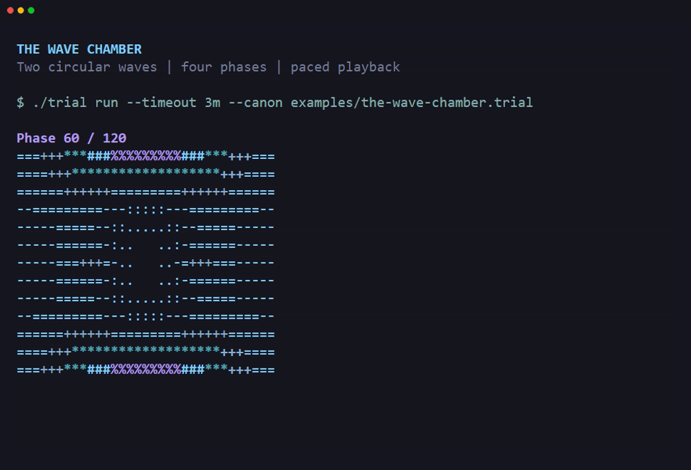
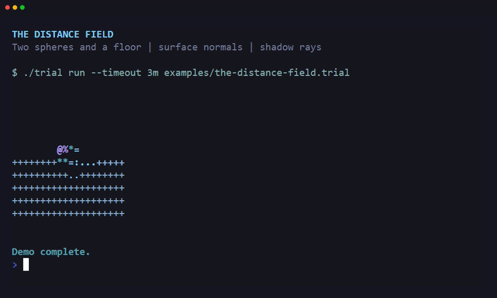

# CPU shaders

A shader computes the appearance of a pixel. These examples compute ASCII
frames in triallang on the CPU. Each character comes from arithmetic in the
source, rather than a stored image.

The examples use integers for coordinates, distance, and brightness. Fixed-point
arithmetic represents fractions with scaled integers. These programs do not
require a GPU, a graphics library, or floating-point values.

## Run the examples

Install the Go version from [CONTRIBUTING.md](../CONTRIBUTING.md).
From the repository root, run these commands. The `--canon` flag loads the
bundled statutes that the wave example needs.

```console
go run ./cmd/trial run examples/the-julia-set.trial
go run ./cmd/trial run --canon examples/the-wave-chamber.trial
go run ./cmd/trial run examples/the-distance-field.trial
```

`trial run` stores the case in memory. It prints completed frames and stops
when the case ends. Closing the process loses its records.

The examples have finite loops and need no input. The wave example prints four
frames in order. It does not clear the terminal or wait between frames.

| Example | Default output | Main technique |
| --- | --- | --- |
| [The Julia set](../examples/the-julia-set.trial) | One 49 by 17 frame | Repeated complex multiplication |
| [The wave chamber](../examples/the-wave-chamber.trial) | Four 33 by 13 frames | Two circular waves with a changing phase |
| [The distance field](../examples/the-distance-field.trial) | One 20 by 10 frame | Distance-based ray steps, surface normals, and shadows |

The recordings below show each example in a terminal. Their pauses give you
time to read the output. The wave recording redraws each frame in place.
See [recording instructions](examples.md#record-the-examples)
to reproduce the GIFs with their VHS tapes.

## The Julia set



[Recording tape](demos/the-julia-set.tape)

A complex number has real and imaginary components. This shader follows
`z = z*z + c` for each pixel. It stores both components as integers scaled by
10,000.

The initial value of `z` comes from the pixel position. The constant `c` is
`-0.8 + 0.156i`. The shader stops an orbit when its squared magnitude exceeds
four, or after 32 updates.

The old real component must serve both products in each update. The shader
stores the new real component in `next-real`. It updates `zy` before it
replaces `zx` with that new value.

The number of updates selects a character from the brightness ramp. The `@`
character marks an orbit that reaches the update limit. It does not prove
that the point belongs to the infinite Julia set.

To change the shape, edit `real-c` and `imaginary-c` in Article 1. For example,
`-7500` and `1100` represent `-0.75 + 0.11i`. Keep the squared magnitude of
`c` at most four for the radius-two escape rule.

## The wave chamber



[Recording tape](demos/the-wave-chamber.tape)

Interference is the sum of overlapping waves. This shader places two sources
at `(-6, 0)` and `(6, 0)`. Each source emits a circular wave with the same
frequency and phase.

For each pixel, the shader computes the distance to each source. It stores
positions in tenths of a cell before the integer square root. The resulting
distance keeps that scale until the angle calculation.

The trigonometry statute divides a circle into 120 angle units. One cell spans
six angle units. The two sine values add to a brightness value between -2000
and 2000.

The four frames use phases 0, 30, 60, and 90. A phase of 120 repeats the
first frame. A phase change of 60 reverses the sign of the combined wave.

The field stays symmetric about both axes. Two equal sources cause the
horizontal symmetry. Distance from the source axis causes the vertical
symmetry.

## The distance field



[Recording tape](demos/the-distance-field.tape)

A signed distance is negative inside a surface. The scene combines two
spheres and a floor by taking the minimum of their distances. Coordinates
use 1,000 units per one world unit.

The first sphere has center `(0, 0, 0)` and radius 750. The second has center
`(1100, -300, 700)` and radius 500. The floor lies at `y = -800`.

Ray marching advances a ray by the current distance. Each camera ray starts
at `(0, 800, -3500)`. Its direction uses a conservative length estimate, so
rounding does not create a direction longer than one unit.

Each ray stops when the signed distance is at most four units. It also stops
after 48 distance samples or after its travel exceeds 9,000 units. A ray that
reaches either limit produces a background pixel.

A surface normal points away from a surface. The shader samples distances
12 units to either side of the hit along each axis. For floor points far
from the second sphere, it uses the exact upward normal.

The light points toward `(-1, 1, -1)`. The dot product of the normal and light
direction controls brightness. A second ray starts 24 units along the normal
from the hit and tests whether another surface blocks the light.

The second ray uses the same distance and iteration limits. A blocked ray
removes direct light, but a small ambient term remains. These finite bounds
and integer rounding make the image an approximation.

Squared distance bounds avoid roots for spheres that cannot change the
minimum distance. Rays above `y = 750` that point level or upward skip the
scene. These bounds depend on the two sphere positions and radii.

If you change the scene, update its bounds and floor shortcut together.
The geometry tests compare the optimized field with direct sphere and plane
distances. Keep those comparisons when you change the shader.

## Change resolution and cost

The shaders assume that a terminal cell is twice as tall as it is wide.
Their vertical coordinates account for that ratio. A font with a different
ratio changes the apparent shape.

The `wide` and `tall` records set the frame dimensions. Keep `wide` above one
and `tall` positive. To preserve the view, scale `wide - 1` and `tall - 1`
by the same factor.

Each extra pixel adds arithmetic and retained execution records. A larger
frame can exceed the snapshot limit even if rendering finishes. The default
dimensions leave room below that limit.

The runtime has a one-million-record limit per recovery snapshot. The shader
tests keep the operand-stack history below 90 percent of that limit. Batching
instructions does not remove that history.

For a slower machine, give the local run more time:

```console
go run ./cmd/trial run --timeout 3m examples/the-distance-field.trial
```

The timeout limits elapsed time. It does not increase the record limit.
To reduce retained records, lower the resolution, iteration limit, or frame
count instead.

Only office parameters are local. Scratch records such as `root-current`
and `ray-travel` belong to the case. These examples call their offices
sequentially and do not recurse.

## Test the calculations

A deposition records the output that a program must produce. These
depositions compare every character and the final dimensions. Each also
requires the case to finish within a finite time limit.

```console
go run ./cmd/trial test examples/the-julia-set.deposition
go run ./cmd/trial test examples/the-wave-chamber.deposition
go run ./cmd/trial test examples/the-distance-field.deposition
go test ./internal/court -run '^TestShader' -count=1 -timeout 5m
```

The Go tests also exercise the calculations independently of the images.
They test known Julia orbits, wave symmetry and phase, and square-root
rounding at estimate boundaries. The distance tests cover sphere interiors,
the floor, ray hits and misses, and blocked and clear light paths.

The tests run the actual triallang offices. They also compare distance
results against direct geometry over a fixed grid. Frame tests enforce
dimensions, character ranges, animation changes, and the record budget.

## Other rendering examples

[The Cornell box](../examples/the-cornell-box.trial) traces intersections with
walls and rotated blocks. [The Castle](../examples/the-castle.trial) casts
rays through a map and accepts movement commands. Both examples compute
their images at runtime.

[The Orrery](../examples/the-orrery.trial) plays a stored sequence of frames.
It demonstrates recorded playback and timed input. Its source does not
compute the displayed geometry.
