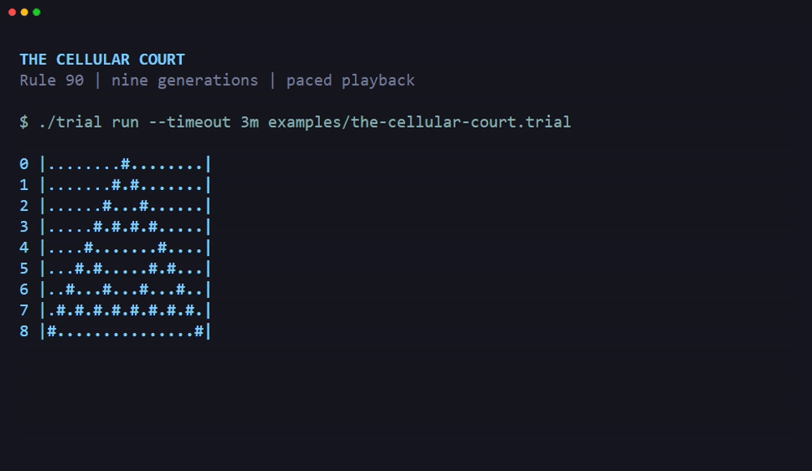
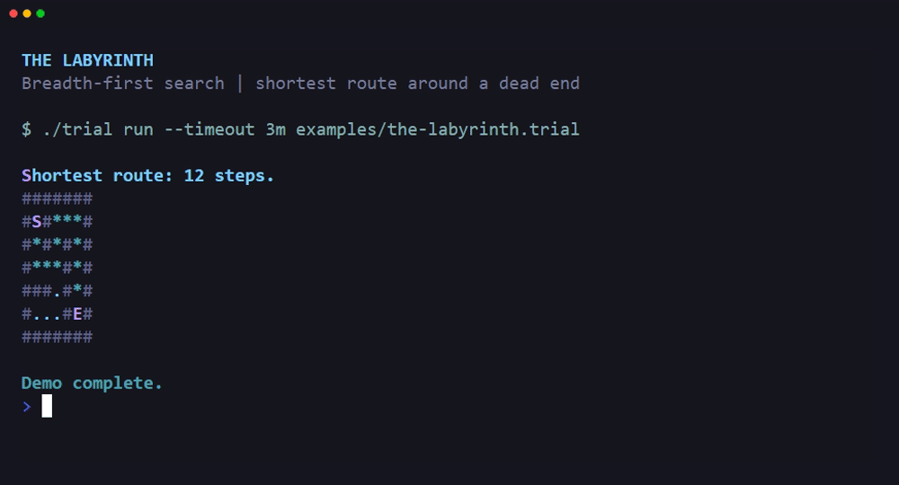
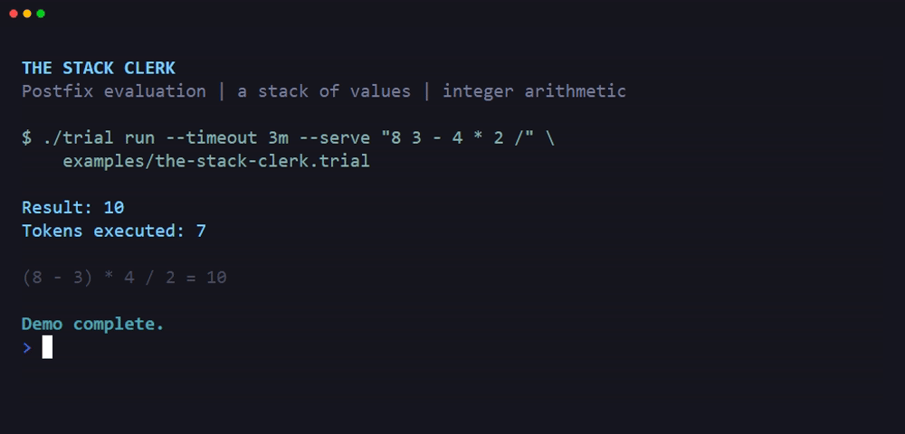

# Small programs to run and change

These examples run without Kafka or external services. Each program uses only
the language built into triallang. Each successful run ends with
`ADJOURN INDEFINITELY`.

You need Go 1.27.0 and a checkout of this repository. From the repository root,
run the commands below. `trial run` prints the output and discards its in-memory
case when the command ends.

The recordings show the programs running in a terminal, with pauses to read
their output. See [recording instructions](examples.md#record-the-examples)
to reproduce them with VHS.

## Draw a cellular automaton



[Recording tape](demos/the-cellular-court.tape)

A cellular automaton updates a grid with neighbor rules.
[The Cellular Court](../examples/the-cellular-court.trial) implements Rule 90.
A cell becomes alive when its left and right neighbors differ.

```console
go run ./cmd/trial run examples/the-cellular-court.trial
```

The initial board has one live cell. The program prints that board and eight
updates. `#` marks a live cell, and `.` marks a dead cell.

```text
0 |........#........|
1 |.......#.#.......|
2 |......#...#......|
3 |.....#.#.#.#.....|
4 |....#.......#....|
5 |...#.#.....#.#...|
6 |..#...#...#...#..|
7 |.#.#.#.#.#.#.#.#.|
8 |#...............#|
```

The program reads the current `cells` schedule and builds `next-cells`.
A schedule is an ordered list of values. The program replaces `cells` only
after it computes the whole next generation. This preserves the old neighbors
during each update.

To change the board, edit `width` and `last-generation` near the top of the
source. The width must be between 1 and 65. The last generation must be between
0 and 32, inclusive. Values outside these bounds cause a verdict with a message.

Cells outside the board are always dead. The board does not wrap at its edges.
For an even width, the initial live cell sits just right of center.

## Find a route through a maze



[Recording tape](demos/the-labyrinth.tape)

[The Labyrinth](../examples/the-labyrinth.trial) searches a maze without diagonal
movement. It uses breadth-first search, which visits nearer cells before farther
cells. The first route that reaches the exit therefore uses the fewest steps.

```console
go run ./cmd/trial run examples/the-labyrinth.trial
```

`S` marks the start, and `E` marks the exit. `#` marks a wall, and `*` marks the
route. The remaining `.` cells include a branch that does not reach the exit.

```text
Shortest route: 12 steps.
#######
#S#***#
#*#*#*#
#***#*#
###.#*#
#...#E#
#######
```

The `queue` schedule holds cells in their visit order. The `predecessor` schedule
records which cell first reached each new cell. After the search reaches the
exit, the program follows those records backward to mark the route.

The program visits each reachable cell at most once. It examines neighbors in
north, east, south, west order. That order decides which route wins when several
routes have the same length.

To draw another maze, edit the strings assigned to `maze`. Keep each displayed
row the same width, and update `width` to match. The program accepts widths from
2 through 25 and at most 225 cells. It treats `#` as a wall and every other
character as an open cell.

Update `start-cell` and `goal-cell` when you move the endpoints. Positions start
at 1 and continue across each row. Use `(row - 1) * width + column` to calculate
a position, with rows and columns both starting at 1. The `S` and `E` characters
are display labels, so they do not set the endpoints themselves.

The program refuses endpoints outside the maze or inside walls. It also refuses
a total length that is not a multiple of the width. If no route reaches the
exit, the program issues a verdict instead of looping forever.

## Evaluate a postfix expression



[Recording tape](demos/the-stack-clerk.tape)

A postfix expression puts each operator after its operands.
[The Stack Clerk](../examples/the-stack-clerk.trial) reads one expression through
a summons. A summons supplies input to a running case.

```console
go run ./cmd/trial run examples/the-stack-clerk.trial --serve "8 3 - 4 * 2 /"
```

The expression means `((8 - 3) * 4) / 2`. The calculator prints the result and
the number of tokens that it processed. A token is one number or operator.

```text
Result: 10
Tokens executed: 7
```

The calculator accepts signed integers and sums with exactly two decimal places.
It supports the operators `+`, `-`, `*`, and `/`. Separate tokens with spaces,
tabs, or line feeds. For another example, replace
the served expression with `12 -5 + 2 *`, which produces `14`.

The stack stores the most recently added value first. Each stack cell is an
exhibit with a `value` entry and a `rest` entry. An exhibit groups named values.
The `rest` entry contains the remaining stack as another nested exhibit.

An operator removes the right operand first, then the left operand. This order
matters for subtraction and division. `3 8 -` produces `-5`, and `-7 2 /`
produces `-3` because integer division truncates toward zero.

When either operand is a sum, arithmetic produces a sum. For example,
`1.20 2 *` produces `2.40`, and `1.00 3 /` produces `0.33`. Sum arithmetic
truncates toward zero to two decimal places.

The calculator converts the summons to text before it reads the tokens. It
limits that text to 128 characters and the stack to 32 values. It refuses
division by zero, missing operands, and expressions that leave more than one
value. Invalid numeric tokens cause the language's number-conversion verdict.
Overflow follows the language rule for signed 64-bit values. Sums store
hundredths in that representation.

If you omit `--serve`, the program waits for input until the runner's timeout.
Use `--serve=-5` to serve a single negative integer. For quoted expressions with
several tokens, keep the whole expression in one argument.

## Make sure that the examples still work

A deposition states a program's expected output and final records. The supplied
depositions cover every output line and the final adjournment. Their 15-second
limits stop a changed example that does not finish.

```console
go run ./cmd/trial test examples/the-cellular-court.deposition
go run ./cmd/trial test examples/the-labyrinth.deposition
go run ./cmd/trial test examples/the-stack-clerk.deposition
```

After you change an example, update its deposition to match the intended result.
Keep the final record assertions so that they test the algorithm as well as its
printed output. To see the output during a deposition run, add `--transcript`.

The Go tests also cover small boards, maze edges, invalid endpoints, and
calculator limits. They include a maze that must refuse movement across a row
boundary. Each test allows up to 30 seconds for a toy to finish, including race
instrumentation. This is a failure bound, not a performance guarantee.
From the repository root, run them with a finite timeout:

```console
go test ./internal/deposition -run 'Test(StackClerk|CellularCourt|Labyrinth)' -count=1 -timeout=60s
```
